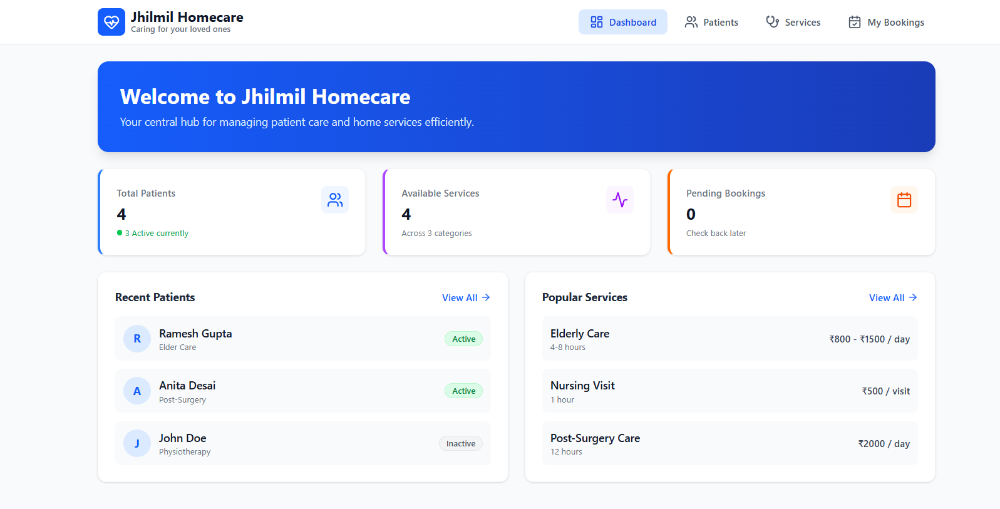
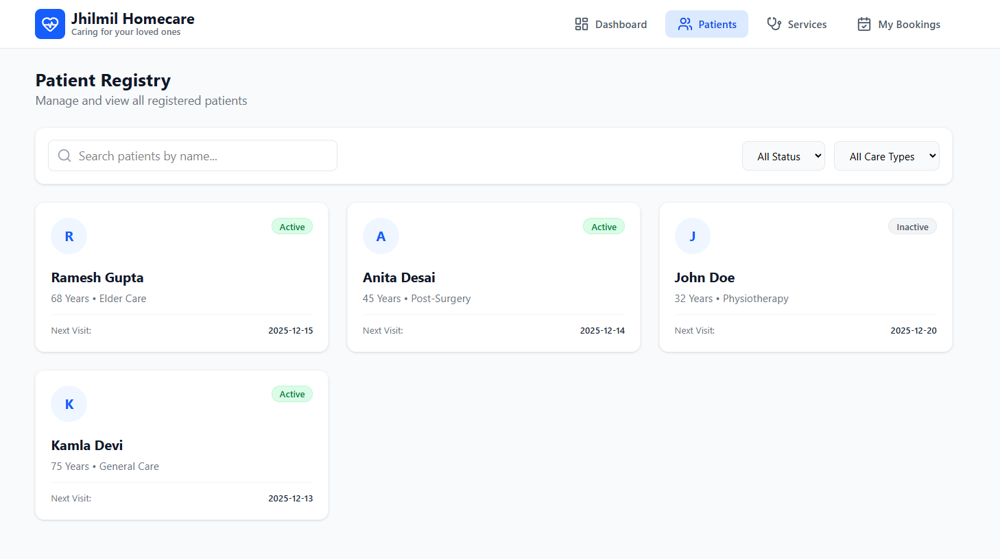
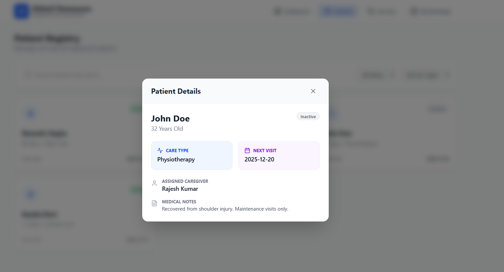
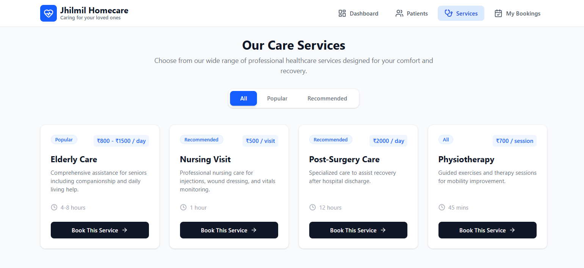
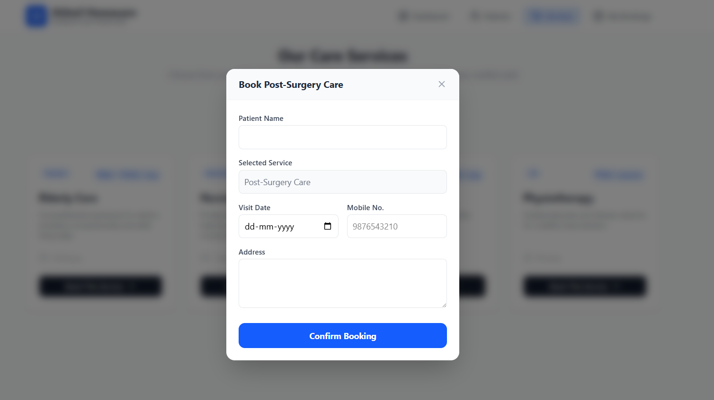
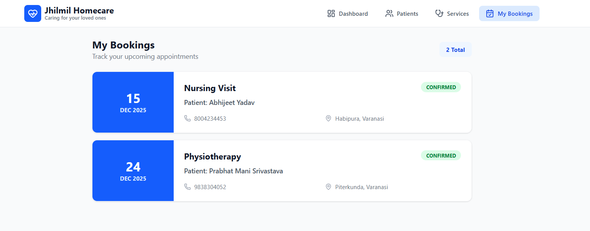

# Jhilmil Homecare Dashboard

A React.js web application for managing homecare services and patient information. This project was built as part of the assignment round for Jhilmil Homecare Services Limited.

## 🚀 Features Implemented

### 1. Dashboard Overview

- Visual summary of total patients, active status, and available services.
- Quick links to recent patients and popular services.
- Responsive grid layout for key metrics.



### 2. Patient Management

- **List View:** Displays patients with status badges (Active/Inactive) and key details.
- **Search & Filter:** Functional search bar (by name) and dropdown filters for Status and Care Type.
- **Detail View:** Modal popup showing complete patient details, assigned caregiver, and medical notes.




### 3. Services & Booking System

- **Service Catalog:** Categorized view (All, Popular, Recommended) of homecare services.
- **Booking Form:** A validated form to book services.
  - Validates required fields and phone number format.
  - Auto-fills the selected service name.
- **Persistence:** Bookings are saved to `localStorage` to simulate a backend.




### 4. My Bookings (Bonus Feature)

- A dedicated page to view all appointments booked by the user.
- Retrieves data from local storage to display booking history even after refreshing the page.



---

## 🛠️ Tech Stack

- **Framework:** React.js (Vite)
- **Styling:** Tailwind CSS
- **Routing:** React Router DOM (v6)
- **Icons:** Lucide React
- **State Management:** React `useState`, `useEffect`
- **Data:** Mock JSON data (No external backend)

---

## ⚙️ Setup & Installation

Follow these steps to run the project locally:

1. **Clone the repository:**

   ```bash
   git clone https://github.com/DarkM4tt/Jhilmil.git
   cd jhilmil
   ```

2. **Install dependencies:**

   ```bash
   npm install
   ```

3. **Run the development server:**

   ```bash
   npm run dev
   ```

4. **Open in browser: Visit http://localhost:5173 (or the port shown in your terminal).**

📝 **Assumptions Made:-**
**Authentication:** No login system was required by the assignment, so the app assumes a "logged-in" admin/user state by default.

**Data Persistence:** Since no real backend was provided, localStorage is used to persist "Bookings" so the user can see the result of their actions across page reloads. Patient and Service data are read-only mock data.

**Design System:** Used a medical/clean aesthetic with blue primary colors to match the "Homecare" theme, utilizing Tailwind for responsiveness.
